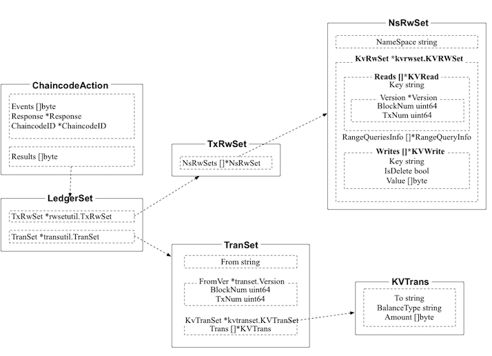

## INK Consortium Blockchain

INK consortium blockchain is an incubating project of Ink Labs Foundation. It is currently at the version of 0.10-preview. We will keep updating and open-sourcing the design and code.

### A trusted consortium blockchain solution for regional use cases

In recent years, blockchain technology has attracted exponentially growing attention in the field. This trend is owing both to the increasingly powerful decentralised general computing capability of the public blockchain, and to the introduction and application of the technology by the professionals in the circle of traditional mainstream technology.

Cryptocurrency, spearheaded by Bitcoin, provided the experimental prototype for the principle of the blockchain technology. Smart contract platform, spearheaded by Ethereum, extends the application of blockchain. Permissioned consortium blockchain, spearheaded by Hyperledger Fabric, opened up a completely new area for the application of blockchain in enterprise. The blockchain is no longer a mere toy for the geeks. It can integrate with mainstream technology system and make its way into enterprise applications. Hyperledger Fabric, for example, realized the identity management mechanism needed under enterprise scenarios. It also substantially integrates the current technological advancement in the fields of distributed computing and security, and provides a series of service and security enhancement for the distributed ledger platform.

Projects on application of blockchain often face the problem of choosing the platform technology. Leveraging a public chain is relatively simple. By encouraging the participants to maintain the blockchain through incentive mechanism, it is endowed with a conducive ecosystem. However, it often suffers from poor performance and lack of permission control, and the information is completely visible to the public. The permissioned consortium blockchain is more applied in the context of business consortium, assuming that there are certain trust premise and interest constraints among the participating parties. The permissioned consortium blockchain tends to compromise on the design of decentralization and accessibility, in exchange for improvement of performance and safety.

The legacy rules of the global Creative Industry are complicated. A collection of social and technical factors must be considered, including law, culture, region, industry, extensibility, security and stability. To establish a cross-region blockchain, INK must make sure all the criteria below are met:

* Regional differences in law, regulation, and culture
* Special requirements for industry and business scenarios
* Optimised governance mechanism of multi-centre collaboration
* Performance requirements for throughput, latency and others
* Accessibility
* Security and privacy
* System adjustment and failure recovery

After going through these complex factors, we found that the existing single-type blockchain platform cannot meet the above requirements simultaneously. The question for us is no longer “selecting an appropriate public or consortium blockchain solution”, but “designing a completely new set of technical solution in light of the stringent requirements to support the business scenario”.

INK has put forward the concept of “trusted consortium blockchain for regional use cases”, which is essentially a consortium blockchain that operates within a specific sovereignty. The structure makes it easier to deal with problems originating from different legal frameworks and different regulatory policies. At the same time, INK focuses on the Creative Industry. The content has a strong cultural attribute. Due to difference in race, history and geographical locations, different parts of the world have markedly different and cultures. Therefore, a consortium blockchain for a specific area and culture will enjoy native and inherent convenience when providing industrial services.

Technically, INK consortium blockchain is a collection of high-performance permissioned blockchain solutions. Its underlying technical framework follows the standards of the Hyperledger project. Aiming at generic application scenarios in a specific geographical region (such as the Creative industry in China), it comes with a series of customisation and enhancement.

INK consortium blockchain also uses the digital certificate mechanism recommended by the industry to realise identification and permission control. The CA node implements the PKI service. It can issue identity certificate in advance, send it to the corresponding entities. At the same time, the INK consortium blockchain can control different entities’ access level of data and resources through fine-grained policy. This solves the question, "when can someone take a particular action under a particular condition".

#### INK Account

INK consortium blockchain has designed and implemented an account system that can cater to a large number of anonymous users (from public blockchain users, or from consumers who are covered by the Consortium Blockchain) to manage digital assets and interact directly with the consortium blockchain. This account system is called INK Account.

Users can generate their own key pairs, through which they can acquire their individual INK Account and the corresponding address. The same account can hold multiple token assets or initiate transactions (either sending tokens or invoking the chaincode, aka smart contract in Fabric) in the name of the account under a given permission. The settings for the account are pluggable, and different consortium blockchains can choose whether to enable the INK Account as well as which account algorithm (in accordance with bitcoins and Qtum, or in accordance with Ethereum) to use. In addition, INK consortium blockchain has developed asset system chaincode (ASCC) to manage the token assets on the chain.

The chaincode invocation request initiated in the name of INK Account requires it to meet the specified rules of signature combination (depending on the degree of openness of the consortium blockchain, it can be batch authorisation or shared authorisation), and the requester should use the INK Account key to sign the invocation contents, including Channel, ChaincodeSpec, transaction counter (for anti-replay attack), etc. The signature will be verified by peers.

#### Transfer Set

INK Account seeks to make up for the lack of token and transferring capability in Fabric. A question often raised is “why don’t we directly develop account and token mechanism based on chaincode?” The key to the question is largely related to the limitations of chaincode. In addition to the imperfection of current cross-chaincode invocation support, another problem that needs to be highlighted is the verification mechanism based on read-write set and multi-version concurrency control (MVCC). Specifically, the basic capabilities provided by the chaincode in Fabric are to read and write the world state. The endorser nodes simulate the execution of the transaction and returns the read-write set as the result. After the recent transactions are ordered by order nodes, the committer nodes need to verify the transaction batch based on MVCC. If a transaction performs a write operation in the verification process, the current version of all states in the read set must be consistent with the version when executing the endorsement. Otherwise, the transaction will be marked as illegal. This is a concession to consistency. A typical consequence is that for a basic operation of token transfer, one account can be operated only once by the transactions in one block.

To tackle the above problems, the INK consortium blockchain has designed and implemented another type of state operation mode for the INK Account and token assets besides the read-write set. The mode is called transfer set, and it is used to record the transfer operations between accounts. Transfer operations only cause the increase or decrease of the corresponding account values, thus the validation of transfer set is not as strict as that of read-write set. Based on the transfer set, the INK consortium blockchain supports multiple transfer-in or transfer-out transactions of the same account in the same batch of transactions. For chaincode development, a number of interfaces have been added to ChaincodeStubInterface, allowing developers to use these capabilities flexibly.

#### SDK and BaaS

The INK consortium blockchain will provide gPRC API to applications, and SDK that encapsulates API for use by the applications. Through SDK, applications can access a wide array of resources in the INK Consortium Blockchain network, such as accounts, transactions, ledgers, smart contracts, events (generated by smart contracts and block commitments), etc. The SDK will also provide functions related to the Creative Industry, including IP registration, verification, etc. SDK will include both NodeJs and Python versions in the early stage.

For developers and testers of blockchain community applications, to build a distributed ledger solution is not an easy task. It requires both hardware infrastructure and a full range of development and operation management. INK Consortium Blockchain will release a fully open Blockchain-as-a-Service (BaaS) platform, which will provide one-stop functions including the establishment of test network, visualization of distributed ledger content, smart contract development and testing, network monitoring and analysis, etc. The blockchain simulation environment provided by the BaaS platform will be very close to real-world application scenarios so that developers can easily migrate their fully-tested business models to the main chain.

In addition, the INK consortium blockchain inherits all the superior features of Hyperledger Fabric, and it carries a series of innovative designs, such as incentive mechanisms, off-chain content storage improvement, as well as cross-chain interoperability, which will be released soon.

### Documentations

[Use Cases](docs/usecases.md)

[Smart Contract Interfaces](docs/chaincode_interfaces.md)

More docs to come!